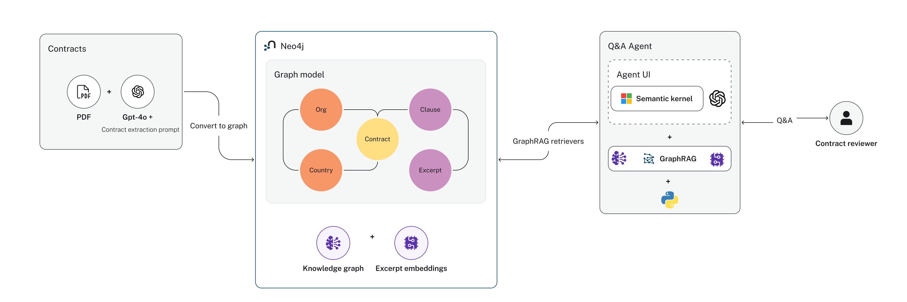
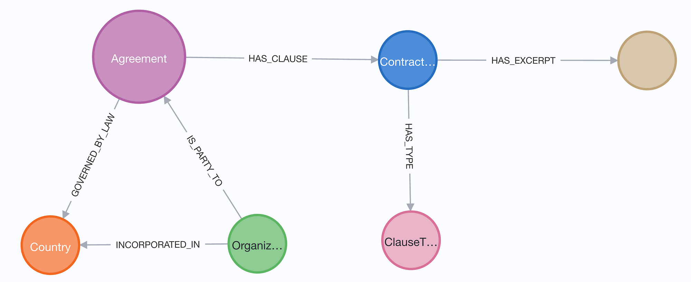
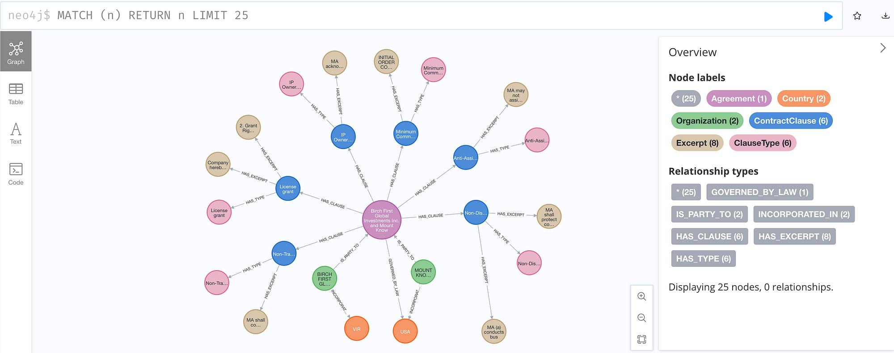

# GraphRAG Contract Review

Hệ thống rà soát hợp đồng thương mại dựa trên **GraphRAG**: thay vì RAG truyền thống (chỉ chia nhỏ văn bản rồi tìm theo vector similarity), hệ thống trích xuất có định hướng (LLM + Prompt) từ hợp đồng để dựng thành **đồ thị tri thức (Knowledge Graph)** trong Neo4j, kết hợp truy hồi bằng vector search trên đồ thị đó, rồi dùng LLM để chấm từng mục trong **checklist thẩm định hợp đồng** (đạt / vi phạm / thiếu thông tin), có trích dẫn Điều khoản làm căn cứ.



## Kiến trúc

```
Hợp đồng (PDF/DOCX/MD)
        │
        ▼
1. Ingestion: parse -> markdown chuẩn hoá -> tách Section/Điều khoản
        │
        ▼
2. Trích xuất tri thức (LLM): các bên, luật áp dụng, loại từng Điều,
   quan hệ chéo giữa các Điều (tham chiếu / phụ thuộc / ngoại lệ)
        │
        ▼
3. Dựng Knowledge Graph (Neo4j) + Vector Index cho từng Điều
        │
        ▼
4. Chấm checklist: truy hồi Điều liên quan (Neo4jVector) -> LLM đánh giá
   -> kết quả kèm căn cứ, lý do, đề xuất, độ tin cậy
```

1. **Trích xuất thông tin từ hợp đồng** (LLM + prompt định hướng theo taxonomy loại điều khoản)
2. **Lưu trữ vào Knowledge Graph** (Neo4j, qua `langchain_neo4j`)
3. **Truy hồi dữ liệu từ Graph** (vector search theo `Excerpt`, kèm ngữ cảnh preamble luôn đính kèm)
4. **Đánh giá checklist bằng LLM** (LangGraph: retrieve -> evaluate), trả kết quả có căn cứ trích dẫn

### Schema đồ thị



### Ví dụ đồ thị sau khi build 1 hợp đồng



## Cài đặt

Dùng cách này khi phát triển/debug local. Để triển khai production, xem [Chạy bằng Docker](#chạy-bằng-docker-production).

Clone repo:

```bash
git clone <repo-url>
cd graphrag-contract-review
```

Tạo virtual environment và cài dependencies:

```bash
python -m venv .venv
```

**Windows**

```bash
.venv\Scripts\activate
```

**macOS / Linux**

```bash
source .venv/bin/activate
```

```bash
pip install -r requirements.txt
```

### Cấu hình `.env`

Tạo file `.env` từ file mẫu:

**Windows**: `copy .env.example .env`
**macOS / Linux**: `cp .env.example .env`

Cập nhật các biến môi trường:

```env
OPENAI_API_KEY=your_api_key

NEO4J_URI=bolt://localhost:7687
NEO4J_USERNAME=neo4j
NEO4J_PASSWORD=your_password

EVALUATOR_MODEL=gpt-4.1-mini
TOP_K_CLAUSES=5
LOG_LEVEL=INFO
```

> Không commit file `.env` thật — chỉ commit `.env.example`. Với production, truyền các biến này qua secret manager / env của platform thay vì file `.env` trên disk.

### Chạy Neo4j (local, độc lập)

```bash
docker run \
    --restart always --env NEO4J_AUTH=neo4j/yourpassword \
    --publish=7474:7474 --publish=7687:7687 \
    --env NEO4J_PLUGINS='["genai","apoc"]' neo4j:latest
```

### Chạy Backend (FastAPI)

Tại thư mục gốc:

```bash
uvicorn main:app --reload --port 8000
```

API: http://127.0.0.1:8000 — lúc khởi động, app tự khởi tạo trước kết nối Neo4j + client LLM/embedding (xem `main.py`), tránh request đầu tiên bị chậm.

### Chạy Frontend

Frontend là HTML/JS thuần (`frontend/`), không cần build:

```bash
cd frontend
python -m http.server 5500
```

Mở http://127.0.0.1:5500 — giao diện dạng chat: upload hợp đồng, nhập câu hỏi hoặc đính kèm checklist JSON, xem kết quả kèm Điều khoản trích dẫn (panel Evidence).

## Chạy bằng Docker (production)

`docker-compose.yml` dựng đủ 3 service: Neo4j, API (`Dockerfile`), frontend (`frontend/Dockerfile`, phục vụ qua Nginx).

1. Tạo `.env` như hướng dẫn ở trên (đặt `NEO4J_PASSWORD` mạnh, không dùng giá trị mặc định `testpassword123`).
2. Khởi động:

   ```bash
   docker compose up -d --build
   docker compose ps
   ```

3. Truy cập:
   - Frontend: http://localhost:5500
   - API: http://localhost:8000
   - Neo4j Browser: http://localhost:7475 (Bolt nội bộ giữa các container: `bolt://neo4j:7687`; expose ra host ở cổng `7688` để tránh xung đột nếu máy đã có Neo4j sẵn)

4. Theo dõi log / health:

   ```bash
   docker compose logs -f api
   docker compose ps      # neo4j có healthcheck, api chờ neo4j "healthy" mới start
   ```

5. Dừng (giữ lại dữ liệu graph trong volume `neo4j_data`):

   ```bash
   docker compose down
   ```

Log của cả 3 service được giới hạn (`json-file`, tối đa 10MB × 3 file) để tránh phình đĩa khi chạy dài hạn.

## Luồng xử lý chi tiết

### 1. Ingestion — từ file hợp đồng tới danh sách Điều khoản

`POST /api/contracts` (`src/api/routes/contracts.py` → `services/contract_service.py`):

- PDF/DOCX: parse bằng [Docling](https://github.com/docling-project/docling) (`src/ingestion/docling_parser.py`) ra markdown.
- `.md`/`.txt`: đọc trực tiếp.
- Markdown được chuẩn hoá (`src/ingestion/text_cleanup.py`), sau đó tách Section/Điều khoản theo các mẫu `PHẦN`/`CHƯƠNG`/`PART` và `ĐIỀU`/`MỤC`/`ARTICLE` (`src/ingestion/section_splitter.py`), có fallback về 1 Section/1 Clause nếu tài liệu không theo mẫu nào. Phần mở đầu hợp đồng (các bên, người đại diện, ngày ký...) được tách riêng thành 1 "Điều" đặc biệt (`is_preamble=True`) để luôn được đính kèm khi truy hồi.

### 2. Trích xuất tri thức bằng LLM

`src/llm/graph_extraction.py`: gọi LLM (`ChatOpenAI`, structured output theo Pydantic `ContractGraphExtraction` — `src/domain/entities/contract_graph.py`) để trích:

- Các bên tham gia (`Party`) và vai trò
- Luật áp dụng (`GoverningLaw`), phương thức giải quyết tranh chấp (`DisputeResolution`)
- Với mỗi Điều: loại điều khoản (`ClauseType`, ép theo taxonomy cố định 14 loại — `src/domain/clause_taxonomy.py`), thuật ngữ được định nghĩa, và quan hệ chéo với các Điều khác: `REFERS_TO` (tham chiếu), `DEPENDS_ON` (phụ thuộc), `EXCEPTION_TO` (ngoại lệ) — có lọc bỏ tham chiếu tới số Điều không có thật (ảo giác LLM).

### 3. Dựng Knowledge Graph (Neo4j)

`src/graph/builder.py` (dùng `Neo4jGraph` của `langchain_neo4j` — `src/graph/client.py`):

```
Agreement
   ├── HAS_PARTY ───────► Organization
   ├── HAS_SECTION ─────► Section ── HAS_CLAUSE ──► Clause
   │                                                  ├── HAS_EXCERPT ──► Excerpt (có vector embedding)
   │                                                  ├── HAS_TYPE ─────► ClauseType
   │                                                  ├── REFERS_TO / DEPENDS_ON / EXCEPTION_TO ─► Clause
   │                                                  └── DEFINES ──────► Definition
   ├── GOVERNED_BY ─────► GoverningLaw
   └── HAS_DISPUTE_RULE ► DisputeResolution
```

Mỗi hợp đồng có `contract_id` riêng (tự tăng), toàn bộ node được gắn `agreement_id` để nhiều hợp đồng cùng tồn tại độc lập trong 1 Neo4j (`src/graph/schema_migration.py` quản lý constraint/index). Embedding cho từng `Excerpt` được tính bằng `text-embedding-3-small` (`src/llm/embeddings.py`) và lưu qua vector index `excerpt_embedding`.

### 4. Truy hồi + Chấm checklist

`src/retrieval/vector_retriever.py` dùng `Neo4jVector` (`langchain_neo4j`) để truy hồi top-k Điều liên quan nhất theo similarity với câu hỏi checklist, luôn kèm thêm Điều preamble làm ngữ cảnh nền. `src/rag/checklist_graph.py` (LangGraph) điều phối luồng `retrieve -> evaluate` cho từng mục checklist; `src/llm/checklist_evaluation.py` gọi LLM đánh giá đạt/vi phạm kèm lý do, đề xuất, độ tin cậy.

## API

- `GET /api/contracts` — liệt kê hợp đồng đã import
- `GET /api/contracts/{id}` — chi tiết 1 hợp đồng
- `POST /api/contracts` — import hợp đồng mới (multipart file)
- `DELETE /api/contracts/{id}` — xoá riêng 1 hợp đồng khỏi graph
- `POST /api/checklist-item` — chấm 1 câu hỏi đơn lẻ (kèm `contract_id`, có thể bổ sung "Đạt khi"/"Vi phạm khi"/"Lưu ý")
- `POST /api/checklist` — chấm hàng loạt theo file checklist JSON (kèm `contract_id`)

## Công cụ dòng lệnh

Trước khi chạy bất kỳ script nào bên dưới, nhớ activate virtual environment (xem [Cài đặt](#cài-đặt)):

**Windows**: `.venv\Scripts\activate`
**macOS / Linux**: `source .venv/bin/activate`

Build graph cho 1 hợp đồng đã có sẵn markdown đã parse:

```bash
python scripts/build_graph.py --contract path/to/contract.parsed.md [--contract-id 5]
```

Chấm checklist cho 1 hợp đồng qua CLI (song song nhiều mục, `--max-workers`):

```bash
python scripts/evaluate_checklist.py --checklist path/to/checklist.json --contract-id 1 --out report.json
```

Benchmark CHỈ retrieval (không tốn LLM, tất định) - đo recall/precision + mức độ "kéo theo" của
graph traversal trên `data/benchmark/retrieval/ground_truth.json`, ghi kết quả JSON vào
`data/output/retrieval/`:

```bash
python scripts/benchmark_retrieval.py [--ground-truth path/to/ground_truth.json]
```

Xuất dữ liệu cho `index.html` (Evidence Graph theo từng mục checklist) - chạy THẬT qua pipeline đầy
đủ (tốn LLM), ghi JSON vào `data/output/eval/`:

```bash
python scripts/build_evidence_graph_export.py --contract-id 1 --checklist data/benchmark/bm01_checklist_input.json
```

Mở `index.html` ở gốc repo, bấm nút chọn file, chọn file JSON vừa xuất để xem cây quan hệ đồ thị
(root/chain) dẫn tới từng Điều khoản khớp cho mỗi mục checklist, kèm status/bằng chứng/lý do.

Xuất dữ liệu cho `graph.html` (danh sách phẳng toàn bộ Điều khoản 1 hợp đồng, click xem liên kết) -
đọc thẳng Neo4j, KHÔNG tốn LLM:

```bash
python scripts/build_contract_graph_export.py --contract-id 1
```

Mở `graph.html` ở gốc repo, chọn file JSON vừa xuất - sidebar trái liệt kê mọi Điều khoản (tìm kiếm
được), click 1 Điều khoản để xem nội dung + liên kết đi ra/đi vào (REFERS_TO/DEPENDS_ON/
EXCEPTION_TO/REFERS_TO_APPENDIX/DEFINES/CONTAINS), click vào 1 liên kết để mở nội dung ngay tại chỗ
hoặc bấm "nhảy tới" để chuyển sang xem trang của Khoản đó.

## Đánh giá (Evaluation)

`evaluation/evaluate.py` so sánh kết quả hệ thống với ground truth thủ công. `data/benchmark/` chỉ chứa
input cố định để test (checklist mẫu + ground truth), KHÔNG chứa kết quả chạy - mọi output sinh ra
mỗi lần chạy pipeline/eval (system_output, report) lưu vào `data/output/`:

```bash
python evaluation/evaluate.py --system-output data/output/bm01_system_output.json --report-out data/output/bm01_report.json
```
